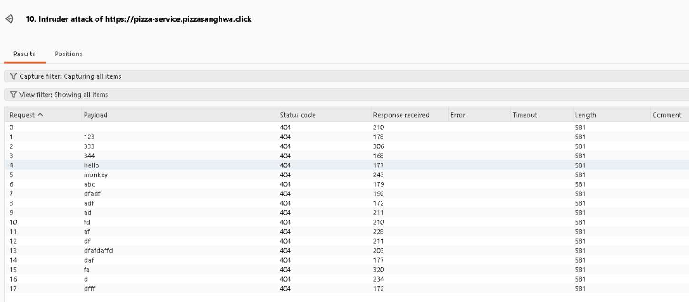
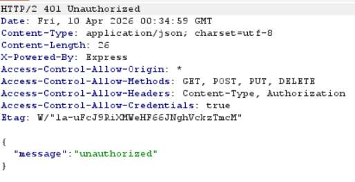
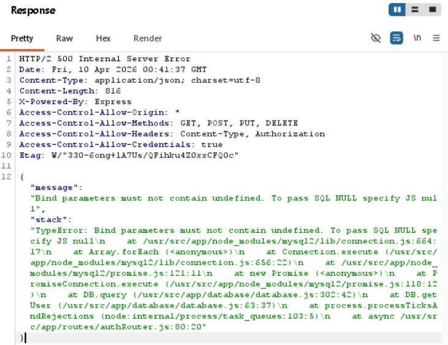
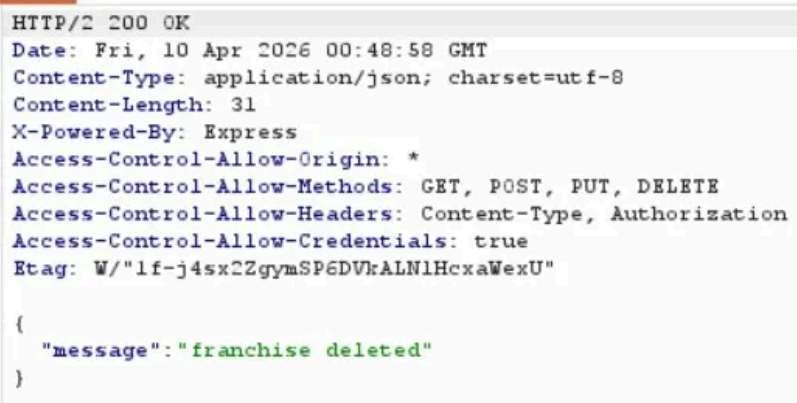
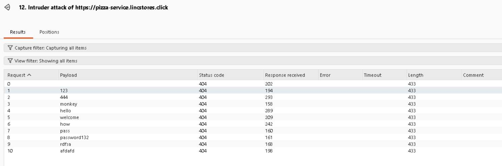
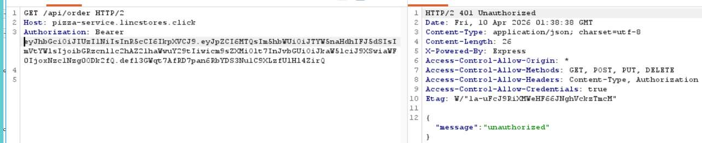
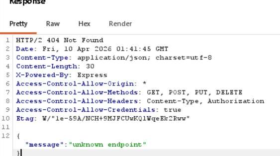
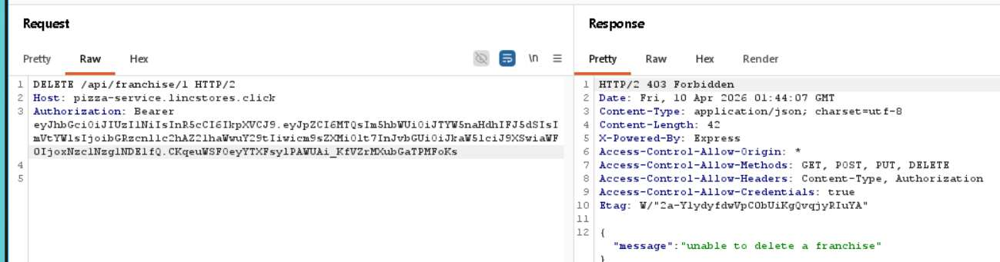

**Sanghwa Ryu and Lincoln Neilsen**

## Lincoln Neilsen's self attack

1. [Github](https://github.com/LincolnNeilsen/jwt-pizza/blob/main/penetrationTesting/attacks.md)
2. https://github.com/LincolnNeilsen/jwt-pizza/blob/main/penetrationTesting/attacks.md

---

## Sanghwa Ryu's self attack

### 1.

| Item           | Result                                                                                                                                                                                                                                                          |
| -------------- | --------------------------------------------------------------------------------------------------------------------------------------------------------------------------------------------------------------------------------------------------------------- |
| Date           | April 9th, 2026                                                                                                                                                                                                                                                 |
| Target         | pizza-service.pizzasanghwa.click                                                                                                                                                                                                                                |
| Classification | Cryptographic Failures / Broken Access Control                                                                                                                                                                                                                  |
| Severity       | 1                                                                                                                                                                                                                                                               |
| Description    | Forged a JWT token with alg:none and roles:[{role:"admin"}]. GET /api/franchise returned 200 but with empty data. POST /api/franchise correctly returned 401 Unauthorized. Server properly validates the role for write operations.                              |
| Corrections    | None needed : server correctly rejected privilege escalation. Consider explicitly rejecting alg:none tokens at the middleware level regardless.                                                                                                                  |

### 2.

| Item           | Result                                                                                                                                                                                                                                                          |
| -------------- | --------------------------------------------------------------------------------------------------------------------------------------------------------------------------------------------------------------------------------------------------------------- |
| Date           | April 9th, 2026                                                                                                                                                                                                                                                 |
| Target         | pizza-service.pizzasanghwa.click                                                                                                                                                                                                                                |
| Classification | Identification/Auth Failures                                                                                                                                                                                                                                    |
| Severity       | 2                                                                                                                                                                                                                                                               |
| Description    | Sent 17 rapid login attempts with common passwords against a real user account. The server returned 404 for each failed attempt with no rate limiting, no lockout, and no CAPTCHA. A real attacker could run thousands of attempts unimpeded.                   |
| Images         |                                                                                                                                                                                                                    |
| Corrections    | Implement rate limiting (e.g., max 5 attempts per minute per IP), account lockout after repeated failures, or add CAPTCHA.                                                                                                                                      |

### 3.

| Item           | Result                                                                                                                                                                                                                                                          |
| -------------- | --------------------------------------------------------------------------------------------------------------------------------------------------------------------------------------------------------------------------------------------------------------- |
| Date           | April 9th, 2026                                                                                                                                                                                                                                                 |
| Target         | pizza-service.pizzasanghwa.click                                                                                                                                                                                                                                |
| Classification | Identification/Auth Failures                                                                                                                                                                                                                                    |
| Severity       | 0                                                                                                                                                                                                                                                               |
| Description    | Captured a valid JWT token after login, then logged out and attempted to reuse the old token on GET /api/order. Server returned 401 Unauthorized — token was properly invalidated on logout                                                                     |
| Images         |                                                                                                                                                                                                                |
| Corrections    | None needed — token invalidation is working correctly.                                                                                                                                                                                                          |

### 4.

| Item           | Result                                                                                                                                                                                                                                                                                                                                                                                                                    |
| -------------- | ------------------------------------------------------------------------------------------------------------------------------------------------------------------------------------------------------------------------------------------------------------------------------------------------------------------------------------------------------------------------------------------------------------------------- |
| Date           | April 9th, 2026                                                                                                                                                                                                                                                                                                                                                                                                           |
| Target         | pizza-service.pizzasanghwa.click                                                                                                                                                                                                                                                                                                                                                                                          |
| Classification | Security Misconfig                                                                                                                                                                                                                                                                                                                                                                                                        |
| Severity       | 2                                                                                                                                                                                                                                                                                                                                                                                                                         |
| Description    | Sending PUT /api/auth with an empty JSON body {} triggered a 500 error that returned a full stack trace including internal file paths (/usr/src/app/), database technology (MySQL2), framework (Express/Node.js), and exact source file locations (authRouter.js:80, database.js:302). Additionally, X-Powered-By: Express header is present on all responses and CORS is set to Access-Control-Allow-Origin: *.           |
| Images         |                                                                                                                                                                                                                                                                                                                                                                                     |
| Corrections    | Add a global error handler that returns generic error messages in production. Remove X-Powered-By header using app.disable('x-powered-by'). Restrict CORS to your frontend domain instead of *.                                                                                                                                                                                                                           |

### 5.

| Item           | Result                                                                                                                                                                                                                                                                                                                                                                             |
| -------------- | ---------------------------------------------------------------------------------------------------------------------------------------------------------------------------------------------------------------------------------------------------------------------------------------------------------------------------------------------------------------------------------- |
| Date           | April 9th, 2026                                                                                                                                                                                                                                                                                                                                                                    |
| Target         | pizza-service.pizzasanghwa.click                                                                                                                                                                                                                                                                                                                                                   |
| Classification | Broken Access Control                                                                                                                                                                                                                                                                                                                                                              |
| Severity       | 3                                                                                                                                                                                                                                                                                                                                                                                  |
| Description    | Authenticated as a regular diner user and sent DELETE /api/franchise/1 with a valid but non-admin JWT token. Server returned 200 OK with {"message":"franchise deleted"} — no admin role check was enforced on the delete franchise endpoint. A regular user can delete any franchise by simply knowing its ID. Other admin endpoints (GET /api/user, GET /api/admin, PUT /api/user/1) correctly returned 401 Unauthorized, indicating the vulnerability is isolated to the franchise delete route. |
| Images         |                                                                                                                                                                                                                                                                                                                                    |
| Corrections    | Add admin role authorization middleware to the DELETE /api/franchise/:franchiseId route in franchiseRouter.js. Verify all franchise management routes (POST, DELETE) require admin role checks. Conduct a full audit of all destructive endpoints to ensure proper authorization is enforced.                                                                                        |

---

## Peer Attack

### Lincoln Neilsen attack on Sanghwa Ryu

1. [Github](https://github.com/LincolnNeilsen/jwt-pizza/blob/main/penetrationTesting/peerAttacking.md)
2. https://github.com/LincolnNeilsen/jwt-pizza/blob/main/penetrationTesting/peerAttacking.md

---

## Sanghwa Ryu attack on Lincoln Neilsen

### 1.

| Item           | Result                                                                                                                                                                                                                                                                  |
| -------------- | ----------------------------------------------------------------------------------------------------------------------------------------------------------------------------------------------------------------------------------------------------------------------- |
| Date           | April 9th, 2026                                                                                                                                                                                                                                                         |
| Target         | https://pizza.lincstores.click/                                                                                                                                                                                                                                         |
| Classification | Cryptographic Failures / Broken Access Control                                                                                                                                                                                                                          |
| Severity       | 1                                                                                                                                                                                                                                                                       |
| Description    | Forged a JWT token with alg:none and roles:[{role:"admin"}]. GET /api/franchise returned 200 but with empty data. POST /api/franchise correctly returned 401 Unauthorized. Server properly validates the role for write operations.                                      |
| Corrections    | Add admin role authorization middleware to the DELETE /api/franchise/:franchiseId route in franchiseRouter.js                                                                                                                                                           |

### 2.

| Item           | Result                                                                                                                                                                                                                                                              |
| -------------- | ------------------------------------------------------------------------------------------------------------------------------------------------------------------------------------------------------------------------------------------------------------------- |
| Date           | April 9th, 2026                                                                                                                                                                                                                                                     |
| Target         | pizza-service.lincstores.click                                                                                                                                                                                                                                      |
| Classification | Identification/Auth Failures                                                                                                                                                                                                                                        |
| Severity       | 2                                                                                                                                                                                                                                                                   |
| Description    | Sent 10 rapid login attempts with common passwords against a real user account. Server returned 404 for each failed attempt with no rate limiting, no lockout, and no CAPTCHA. A real attacker could run thousands of attempts unimpeded.                            |
| Images         |                                                                                                                                                                                                          |
| Corrections    | Implement rate limiting (e.g., max 5 attempts per minute per IP), account lockout after repeated failures, or add CAPTCHA.                                                                                                                                          |

### 3.

| Item           | Result                                                                                                                                                                                                                  |
| -------------- | ----------------------------------------------------------------------------------------------------------------------------------------------------------------------------------------------------------------------- |
| Date           | April 9th, 2026                                                                                                                                                                                                         |
| Target         | pizza-service.lincstores.click                                                                                                                                                                                          |
| Classification | Identification and Authentication Failures                                                                                                                                                                              |
| Severity       | 0                                                                                                                                                                                                                       |
| Description    | Captured a valid JWT token after login, logged out, then attempted to reuse the old token on GET /api/order. Server returned 401 Unauthorized — token was properly invalidated on logout.                               |
| Images         |                                                                                                                                                                |
| Corrections    | None needed                                                                                                                                                                                                             |

### 4.

| Item           | Result                                                                                                                                                                                                                                                                     |
| -------------- | -------------------------------------------------------------------------------------------------------------------------------------------------------------------------------------------------------------------------------------------------------------------------- |
| Date           | April 9th, 2026                                                                                                                                                                                                                                                            |
| Target         | pizza-service.lincstores.click                                                                                                                                                                                                                                             |
| Classification | Security Misconfiguration                                                                                                                                                                                                                                                  |
| Severity       | 1                                                                                                                                                                                                                                                                          |
| Description    | Sent malformed requests to trigger error responses. No stack traces were exposed. However X-Powered-By: Express header is present on all responses revealing the tech stack, and Access-Control-Allow-Origin: * allows any domain to make cross-origin requests to the API. |
| Images         |                                                                                                                                                                                                                        |
| Corrections    | None needed, informational finding only.                                                                                                                                                                                                                                   |

### 5.

| Item           | Result                                                                                                                                                                                                   |
| -------------- | -------------------------------------------------------------------------------------------------------------------------------------------------------------------------------------------------------- |
| Date           | April 9th, 2026                                                                                                                                                                                          |
| Target         | pizza-service.lincstores.click                                                                                                                                                                           |
| Classification | Broken Access Control                                                                                                                                                                                    |
| Severity       | 0                                                                                                                                                                                                        |
| Description    | Authenticated as a regular diner and sent DELETE /api/franchise/1. Server correctly returned 403 Forbidden with {"message":"unable to delete a franchise"} — admin role check is properly enforced on the franchise delete endpoint. |
| Images         |                                                                                                                                               |
| Corrections    | None needed                                                                                                                                                                                              |

---

## Combined summary of learnings

Both penetration tests showed that the core JWT authentication and token invalidation were set up correctly on both sites, but a handful of meaningful security gaps still came up. The most serious issue we found was that on Sanghwa's site, the attacks let a regular user delete franchises without any admin privileges. This was a good reminder that authorization checks can't be assumed; they have to be deliberately applied to every single endpoint. Neither site had rate limiting on the login endpoint either, which means a brute force attack could hammer away at passwords completely unchecked and eventually attain the correct credentials.

On Sanghwa's site, error responses were leaking full stack traces, internal file paths, database details, framework info. This essentially hands an attacker a roadmap of the system. Lincoln's site handled this better, returning clean, generic error messages instead. Both sites also had some smaller misconfigurations worth noting: the X-Powered-By: Express header was exposed, and CORS was set to Access-Control-Allow-Origin: *. Neither is catastrophic on its own, but they're the kind of details that help an attacker build a picture of your system.

The big takeaway from all of this is that security only holds if it's applied consistently, everywhere. One unprotected endpoint or a careless header can quietly undo an otherwise solid security setup.
